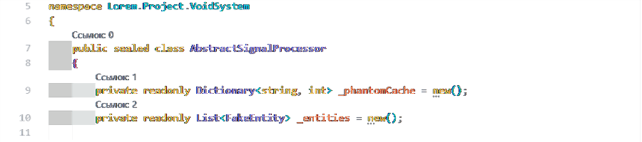

  

<h1>whyhvru</h1>

22 y.o. self-taught Unity / C# developer
with 3+ years of programming experience.  

💼 Worked on:
- 👨‍💻 2 commercial game projects 
- 📚 4 game jam projects - <a href="https://github.com/whyhvru?tab=repositories&q=gamejam">click</a>

I love playing and making games. ❤️

  Gameplay systems · Game architecture · Multiplayer · Tools

